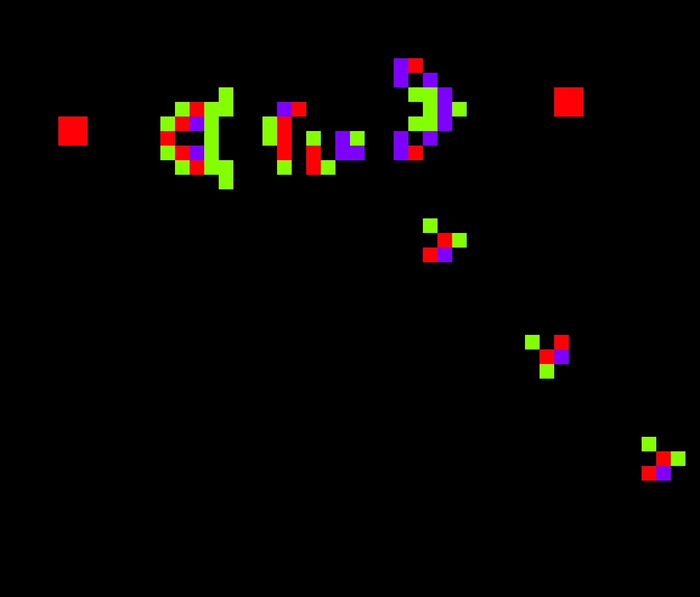
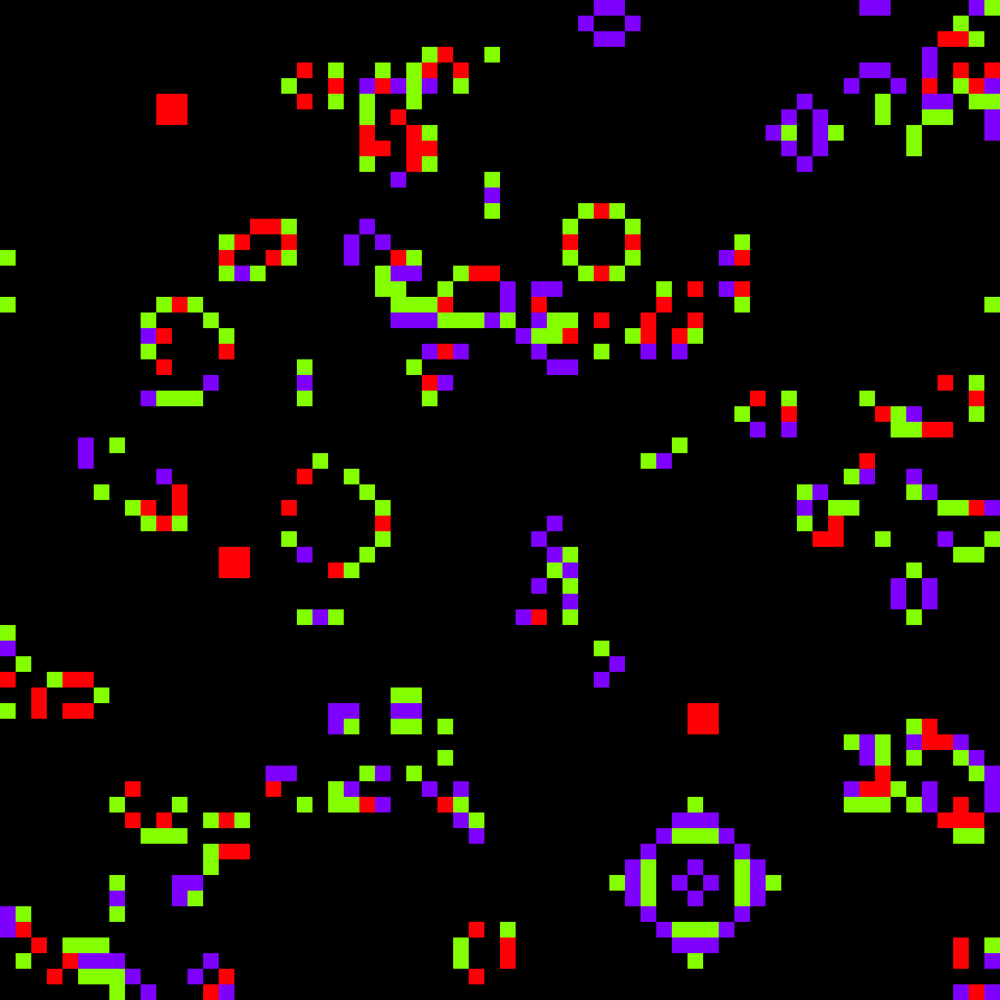
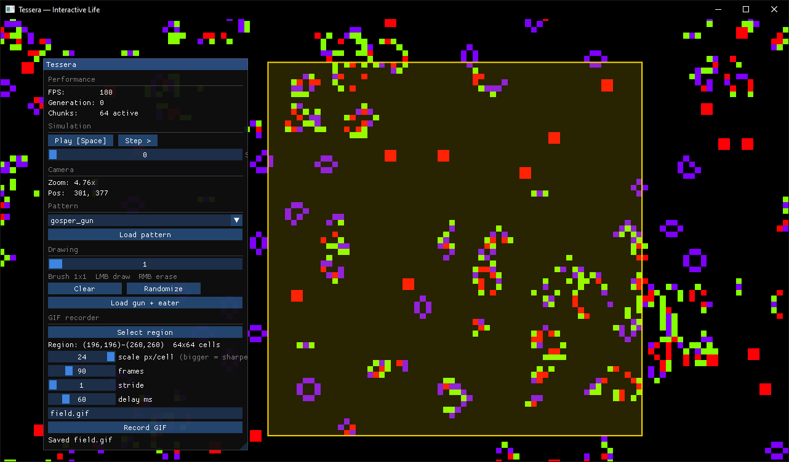

# Tessera


**[English](README.md)**

2D движок клеточных автоматов на C++/CUDA/OpenGL. Мир разбит на чанки — симулируются
только живые, жизнь сама расползается в соседние. Симуляция и рендер работают
в отдельных потоках. Писал, чтобы разобраться с потоками, тред-пулом, CUDA и OpenGL
на практике, а не просто почитать.

---

## Демонстрация

**Пушка Госпера, период 30:**



**Случайное поле 64×64 — видно как жизнь расползается в новые чанки:**



**Capture UI — ImGui-интерфейс для настройки и запуска захвата GIF:**



---

## Зачем я это написал

До этого у меня было:
- поле цветов в консоли Windows (ввод мыши через WinAPI)
- OpenGL-рендерер с нуля (шейдеры, буферы, всё вручную)
- первая попытка «движка» без чанков и без потоков — лагало

Это проект, где я попытался исправить то, что шло не так.

Вопросы, на которые хотел найти ответы:
- Как разделить симуляцию и рендер по потокам, не словив гонки?
- Как написать тред-пул, который реально работает?
- GPU действительно ускоряет — и насколько?

---

## Что умеет

- Мир разбит на чанки — симулируются только живые, жизнь сама активирует соседние
  чанки при достижении их границ (глайдеры корректно пересекают границу чанка).
- Симуляция параллельна — каждый чанк обрабатывается в тред-пуле независимо; рендер
  крутится в отдельном потоке и не тормозит при тяжёлой симуляции.
- Правило автомата — таблица подстановки, не хардкод. Одно правило работает и на CPU,
  и на CUDA без изменений.
- CUDA-бэкенд использует тайлинг в shared memory, чтобы срезать обращения к DRAM.
- Попробовал CUDA-GL interop (писать результат прямо в GL-буфер, минуя PCI-E) —
  на Windows WDDM он gracefully fallback'ается, потому что GL-контекст живёт
  в другом потоке.
- Загружает `.rle`-паттерны (стандарт conwaylife.com), выбрать можно прямо в панели.
- Интерактивное рисование: ЛКМ/ПКМ, панорама, зум, пауза/шаг, скорость симуляции,
  запись выделенной области в GIF.

---

## Как устроено

Изначально было два god-класса, я их разобрал по назначению:

- `ChunkStore` — хранит чанки, их мьютекс и список активных
- `SimulationCoordinator` — запускает одно поколение: раздаёт работу тред-пулу,
  затем коммитит результаты. Маленькая машина состояний
  (`Idle → Computing → ReadyToCommit → Committing`) гарантирует, что вычисление
  и коммит никогда не идут одновременно — соседи всегда читают одно консистентное поколение.
- `ChunkMapRenderer` — рисует видимые чанки
- `ChunkGrid` — геометрия: мировые координаты ↔ локальные координаты чанка
- `CameraController` — WASD / скролл / панорамирование средней кнопкой
- `ChunkedTileMap` — тонкий фасад поверх всего

Бэкенд симуляции спрятан за интерфейсом (`ISimulationBackend`) — CPU и CUDA
взаимозаменяемы, остальной движок не знает, что он получил.

---

## Бенчмарк

Правило Конвея, RTX 30xx, один чанк, 100 итераций. GPU выигрывает только когда
поле достаточно большое, чтобы скрыть overhead запуска ядра:

| Размер чанка | CPU          | CUDA           | Ускорение |
|--------------|--------------|----------------|-----------|
| 256²         | 37 Мкл/с     | 351 Мкл/с      | 9.5×      |
| 512²         | 35 Мкл/с     | 1230 Мкл/с     | 35×       |
| 1024²        | 37 Мкл/с     | 2366 Мкл/с     | 64×       |
| 2048²        | 37 Мкл/с     | 4034 Мкл/с     | 109×      |

Запустить самому: `Test_benchmark <размер_чанка> <итераций>`.

---

## Сборка

Windows, Visual Studio 2022, CMake + Ninja. GLFW / GLAD / GLM / ImGui лежат
в `libs/`, ничего устанавливать отдельно не нужно.

```bash
cmake --preset x64-release
cmake --build out/build/x64-release
```

CUDA опциональна — без неё собирается CPU-only. CMake сам напишет что выбрал:
```
-- CUDA found – GPU simulation backend enabled
-- CUDA not found – building CPU-only simulation backend
```

---

## Демки

```
Demo_life_full         Полная интерактивная игра Жизнь: рисование, панорама/зум,
                       пауза/шаг, выбор паттернов, запись GIF (ImGui-панель).
Demo_life_minimal      Минимальный вариант — случайное поле, больше ничего.
Demo_life_capture_ui   ImGui-утилита для настройки и запуска headless-захвата GIF.
```

Управление (полная демка):

```
ЛКМ          рисовать клетки       Пробел     пауза / продолжение
ПКМ          стирать клетки        Step >     один шаг на паузе
СКМ drag     панорамирование       WASD       панорама клавиатурой
Скролл       зум                   слайдер    скорость симуляции
```

---

## Захват GIF

**Вариант 1 — GUI (`Demo_life_capture_ui`):**
Запусти `Demo_life_capture_ui.exe` — ImGui-окно, где выбираешь сцену, задаёшь
разрешение, путь и жмёшь **Capture!**. По умолчанию сохраняет в
`%USERPROFILE%\Pictures\Tessera\capture.gif`.

**Вариант 2 — командная строка:**
```bash
# пушка + пожиратель -> Pictures\Tessera\capture.gif
python tools\capture_gif.py --exe out\build\x64-release\Test_capture.exe ^
    --scene guns --stop 60 --res 600x360 --region 14 14 80 60

# случайное поле
python tools\capture_gif.py --exe out\build\x64-release\Test_capture.exe ^
    --scene random --stop 40 --res 320x320 --region 0 0 80 80 --out random.gif
```

Требует Pillow: `pip install pillow`.

---

## Тесты

Headless, код возврата 0 = всё прошло. Лежат в `tests/`:

```
Test_correctness   правило + парсер RLE
Test_propagation   глайдер должен пересечь границу чанка целым
Test_capture       детерминированный дамп GIF — регрессионный оракул
Test_benchmark     пропускная способность CPU vs GPU
```

`Test_correctness` проверяет:
- блок (still life) не меняется
- мигалка осциллирует с периодом 2
- глайдер за 4 шага смещается в правильную позицию
- CPU и CUDA дают побайтово одинаковый результат за 100 шагов на одном входе
- парсер RLE корректно декодирует длины серий, прыжки строк и пробелы

`Test_propagation` появился, когда выяснилось, что глайдеры «обрезаются» на границе
чанка — тест ставит глайдер у самой границы и проверяет, что он вышел с другой
стороны в правильной форме и позиции.

---

## Что ещё не сделано

- CUDA-GL interop пока fallback'ается на WDDM (симуляция работает в воркер-потоках,
  где GL-контекст недоступен).
- Только 2-состояния, тоталистические life-like правила (нет multi-state автоматов).
- Мир фиксированного размера, не по-настоящему бесконечный.
